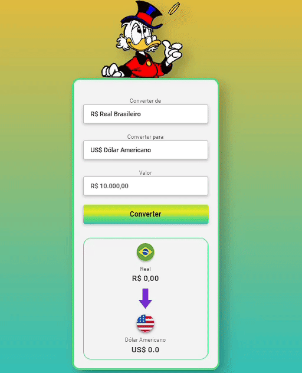

# Conversor de Moedas :rocket:
Este projeto é um conversor de moedas desenvolvido como parte do curso Desenvolvedor Full Stack do DevClub, ministrado pelo professor Rodolfo Mori. Utilizando HTML, CSS e JavaScript, este conversor permite aos usuários converter valores entre diferentes moedas de forma fácil e intuitiva.

## Tecnologias Utilizadas :computer: 
- HTML: Utilizado para estruturar a página web.
- CSS: Responsável pelo estilo e aparência visual do conversor, tornando-o atraente e amigável.
- JavaScript: A linguagem de programação utilizada para implementar a lógica de conversão de moedas, garantindo funcionalidades dinâmicas e interativas.

## Principais Funcionalidades  :hourglass_flowing_sand:
- Conversão instantânea entre diversas moedas, incluindo Dólar, Euro, Real, entre outras.
- Interface simples e intuitiva, proporcionando uma experiência de usuário agradável.

